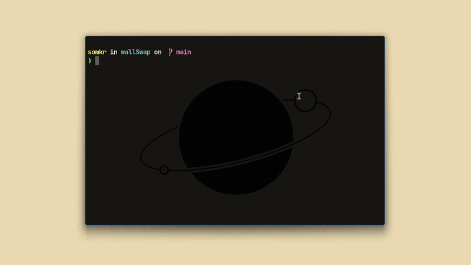

## **WallSwap (Terminal Based Wallpaper Switcher)** 

WallSwap is a lightweight terminal-based tool for managing and swapping wallpapers directly from the command line:
- Change Wallpapers Via Terminal
- Module Based Wallpaper Switch
- Lightweight Written in C
- Uses a Cool Config System
---
